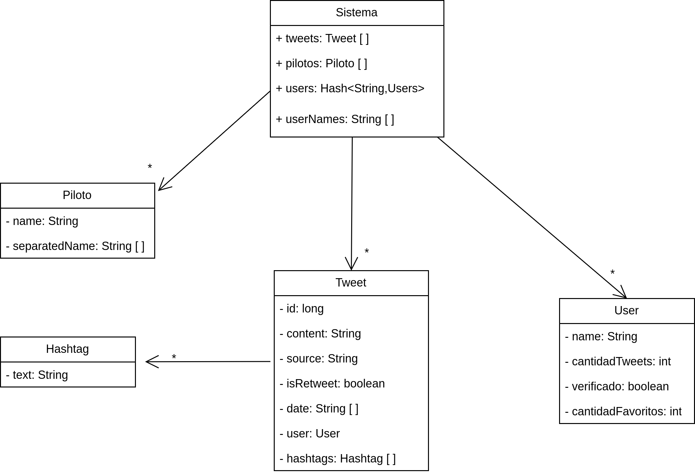
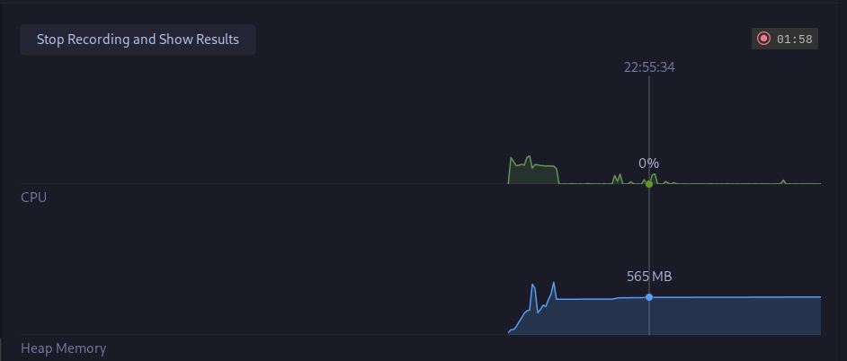
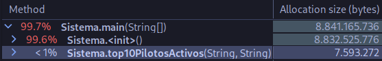
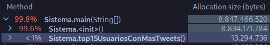
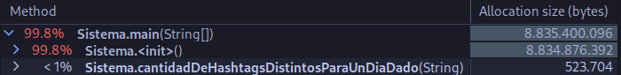
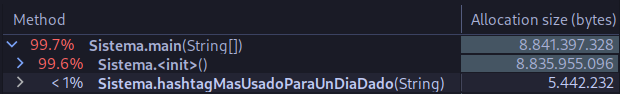

## Informe Obligatorio Progamación 2

------------
### Participantes: Lucas Pintos y Juan Manuel Sanchez.

------------

### Diagrama UML de clases de la solución:

### Descripciones
Para obtener los datos de csv usamos las librerías `java.io.BufferedReader` y `java.io.FileReader`,
donde leemos línea por línea el contenido del csv, siempre verificando que tenga la cantidad correcta de columnas, y
en caso de que no las tenga se rectifica. Una vez que verificamos que la línea está con la información correcta extraemos 
la información necesaria y procedemos a almacenarla en sus respectivas entidades.

Las entidades que usamos para almacenar en memoria los datos son: Tweet, User, Piloto y Hashtag, representadas como se puede ver en UML.

Tiempo que le lleva la lectura del csv: 20 segundos aproximadamente.

Memoria que se usa al leer los tweets: 550MB promedio.

A continuación paso a explicar como pensamos y llevamos a cabo el análisis y desarrollo de las funciones propuestas.

### Top 10 pilotos más mencionados
Para esta función utilizamos un hash como contador para las menciones de los pilotos, para este contador recorrimos
la lista de tweets filtrándolos por la fecha y buscando ocurrencias por nombre de piloto,
luego para ordenarlos usamos un QuickSort.

Fecha utilizada para la prueba: 2021-11

Tiempo que le toma a la función: 0.9 segundos.

Memoria que utiliza: 7.5MB

### Top 15 usuarios con más tweets
Para esta función utilizamos el contador de cantidad de tweets que tiene cada usuario y lo ordenamos
con un MergeSort, esto ya que lo probamos con QuickSort y no tuvimos buenos resultados, utilizaba
demasiada memoria y lanzaba excepciones.

Tiempo que le toma a la función: 0.8 segundos.

Memoria que utiliza: 13.3MB

### Cantidad de hashtags distintos para un día dado
En esta función utilizamos la estructura de dato Hash, con el hashtag como key, para obtener los hashtags
recorrimos la lista de tweets, filtrando por la fecha dada, y cada hashtag que tenía los
tweets lo ingresábamos al hash, por lo que para obtener la cantidad de hashtags usados era
simplemente obtener el size del hash.

Fecha utilizada para la prueba: 2021-12-12

Tiempo que le toma a la función: 0.1 segundos.

Memoria que utiliza: 0.5MB

### Hashtag más usado para un día dado
Para esta función usamos un Hash con hashtag como key y un contador como valor,
con esto, iteramos sobre los tweets, filtrando por la fecha dada, y por los hashtags de cada tweet, incrementando el 
contador en cada ocurrencia, y utilizando dos variables auxiliares, donde almacenamos el hashtag con más
ocurrencias y su contador, mientras vamos iterando sobre los hashtags también nos fijamos el contador
del mismo, y si es más grande que el de la variable auxiliar lo reemplazamos.

Fecha utilizada para la prueba: 2021-12-12

Tiempo que le toma a la función: 0.1 segundos.

Memoria que utiliza: 0.5MB

### Top 7 cuentas con más favoritos
En esta función recorremos los tweets y vamos obteniendo los favoritos de cada usuario,
luego de eso ordenamos la lista de usaurios por cantidad de favoritos con un QuickSort.

Tiempo que le toma a la función: 0.9 segundos.

Memoria que utiliza: No pude encontrar el dato en el profiler.

### Cantidad de tweets con una palabra o frase especificos.
En esta función recibimos una palabra que ingresa el usuario, usamos un contador, luego recorremos la lista de tweets
y sumando al contador si hay ocurrencias de la palabra o frase en el contenido del tweet.

Palabra utilizada para la prueba: RedBull.

Tiempo que le toma a la función: 0.1 segundos.

Memoria que utiliza: No pude encontrar el dato en el profiler.

## Repositorios

Primera entrega (6/6/2023): https://github.com/lucaspintos909/grupo5-p2-tads

Segunda entrega (25/6/2023): https://github.com/lucaspintos909/grupo5-p2-obligatorio
