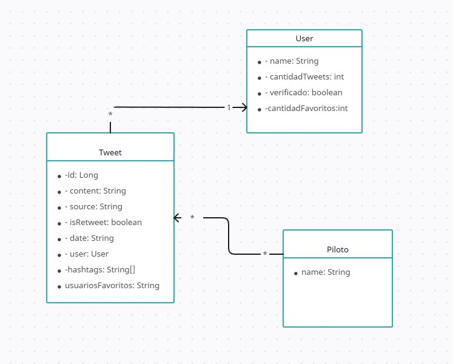

## Informe Obligatorio Progamación 2

------------

### Lucas Pintos y Juan Manuel Sanchez.

------------

#### 1.[Diagrama UML de clases de la solución](####Diagrama UML de clases de la solución)
#### 2.[Descripciones](####Descripciones)
#### 3.[Medición de eficiencia de la aplicación](####Medición de eficiencia de la aplicación)

#### Diagrama UML de clases de la solución:

#### Descripciones
####  Medición de eficiencia de la aplicación